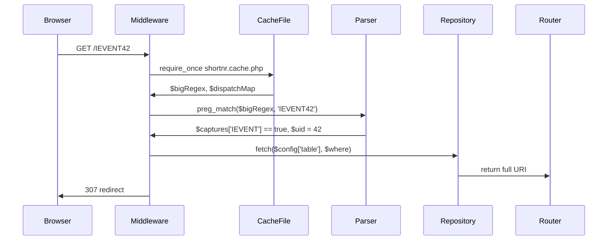
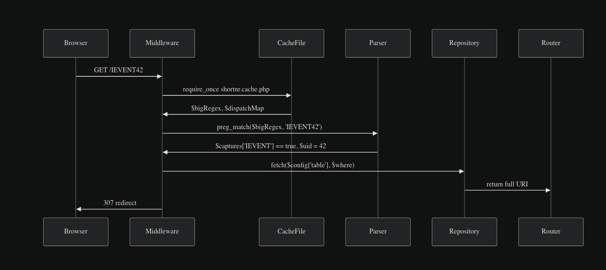

# ShortNr 2.0 – Refactoring Plan & Vision Document
*Hyper-dynamic link shortener for TYPO3, powered by one-line patterns and zero ambiguity.*

---

## 1. Vision

> *“One expressive line per record type, one PCRE match per request.”*

ShortNr 2.0 replaces the brittle `regex + {match-n}` approach with a **declarative pattern string** that
- simultaneously describes the *shape* of the short code,
- names every captured value,
- maps each value 1:1 to a DB column,
- and keeps the rich, narrowing-only condition language intact.

The result:
- YAML files shrink 50 – 70 %.
- Config files become self-documenting.
- Runtime cost stays at **one regex + one hash lookup per request**.

---

## 2. High-Level Data Flow




---

## 3. Module Breakdown

| Module | Responsibility | Public API |
|---|---|---|
| **Compiler** | build-time | `compileAllPatterns(array $yaml): CompiledCache` |
| **Pattern Parser** | string → segments | `parse(string $pattern): Segment[]` |
| **Operator Engine** | run-time filters | `evaluate(array $row, array $condition): bool` |
| **Repository** | DB access | `findRecord(ConfigItem $cfg, array $where): ?array` |
| **Encoder** | record → short | `encode(ConfigItem $cfg, array $record): string` |
| **Decoder** | short → record | `decode(string $path): Decoded` |
| **Cache Writer** | persist compiled artefacts | `write(array $compiled, string $path)` |

---

## 4. New Configuration Schema

### 4.1 Root structure

```yaml
shortNr:
  _settings:               # optional global defaults
    languageField: sys_language_uid
    languageParentField: l10n_parent

  pages:
    pattern: "PAGE{uid:int}-{lang?:int=0}"
    table: pages
    plugin:
      extension: Frontend
      controller: Page
      action: show
    condition:
      doktype: { in: [1, 4] }   # narrowing only
```

### 4.2 Pattern grammar (formal)

```
pattern = literal* (placeholder literal*)*
placeholder = "{" name type? default? modifier? "}"
name        = identifier
type        = ":" ("int" | "slug" | "str" | "uuid")
default     = "=" literal
modifier    = "?" | "!" | "*"
```

Examples

| Pattern                                            | Meaning |
|----------------------------------------------------|---|
| `NEWS{uid:int}`                                    | mandatory integer uid |
| `BLOG{slug:slug}-{lang?:int(default=0)}`           | optional language suffix |
| `VID{youtubeId:str(maxLen=30, allowed=a-zA-Z0-9)}` | plain string |

---

## 5. Compile-Time Artefacts

File: `var/cache/shortnr.cache.php`

```php
return [
    'bigRegex' => '/^(?:
        (?P<PAGE>PAGE(?P<PAGE_uid>\d+)(?:-(?P<PAGE_lang>\d+))?)
      | (?P<IEVENT>IEVENT(?P<IEVENT_uid>\d+))
      | …
    )$/x',

    'dispatch' => [
        'PAGE'   => 'pages',
        'IEVENT' => 'internal_event',
        …
    ],

    'configs' => [
        'pages' => [
            'table'   => 'pages',
            'plugin'  => [ … ],
            'condition' => [ … ],
        ],
        …
    ],
];
```

---

## 6. Runtime Steps (Decoder)

1. **Early exit**
   If path does not match `^/[A-Z]` → continue middleware chain.

2. **Single regex**
   `preg_match()` on `$bigRegex`.

3. **Dispatch**
   `$dispatch[$marker]` → config key.

4. **Where clause**
   ```php
   $where = [
       'uid' => $captures[$marker . '_uid'],
       'sys_language_uid' => $captures[$marker . '_lang'] ?? 0,
   ];
   $where = array_merge($where, $config['condition']);
   ```

5. **Fetch & redirect**
   Query → overlay → build URI → 307.

---

## 7. Encoder (reverse path)

Given a record row:

1. Pick the **highest-priority** config whose `condition` evaluates to `true`.
2. Substitute placeholders in `pattern:` with row values.
3. Drop optional blocks when value equals default.
4. Return the short string.

---

## 8. Migration Path

| Step | Action | Status |
|---|---|---|
| 1 | Add new `pattern:` key to one config item | ✅ |
| 2 | Regenerate cache, deploy, monitor logs | ✅ |
| 3 | When stable, remove legacy keys (`regex`, `{match-n}`) | ✅ |
| 4 | Repeat until all items migrated | |
| 5 | Delete legacy parser & BC layer | |

---

## 9. Open Points / Future Work

- Cache invalidation on TCA change
- CLI command `shortnr:compile`
- Event `AfterShortNrDecodedEvent` for extensibility
- Optional checksum at the end (`{uid:int}(-{lang:int(default=0)})-{crc32}`)

---

## 10. One-Page Cheat Sheet

```
pattern: "PREFIX{uid:int}(-{lang:int(default=0)})?"
         └literal┘└───placeholder──┘
```

- `?` optional, `int` type, `(default=0)` default
- No OR allowed in `condition:`
- One compiled regex per cache file
- One hash lookup per request

---

> Ready for commit 1: Compiler + Cache Writer.
> Ready for commit 2: Middleware rewrite.
